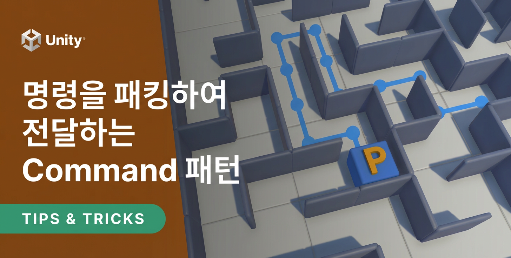
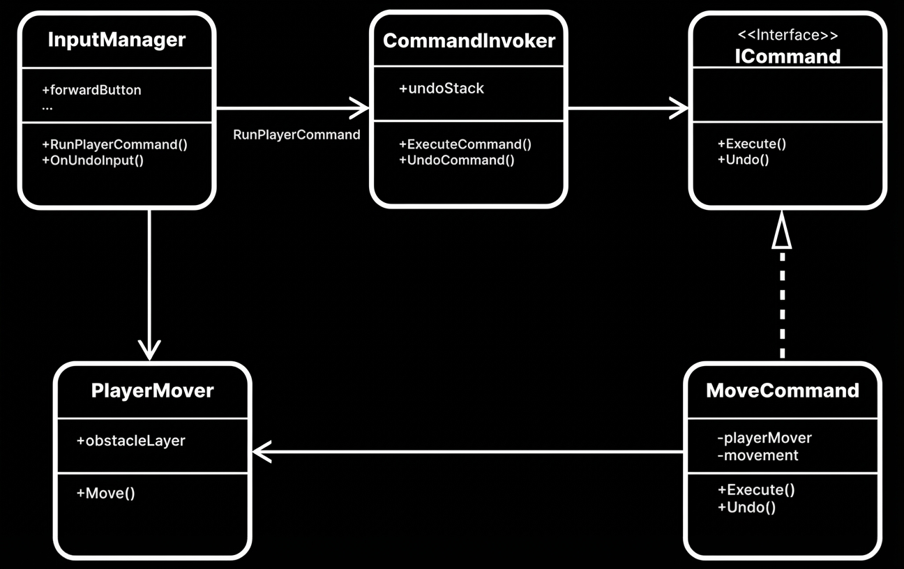
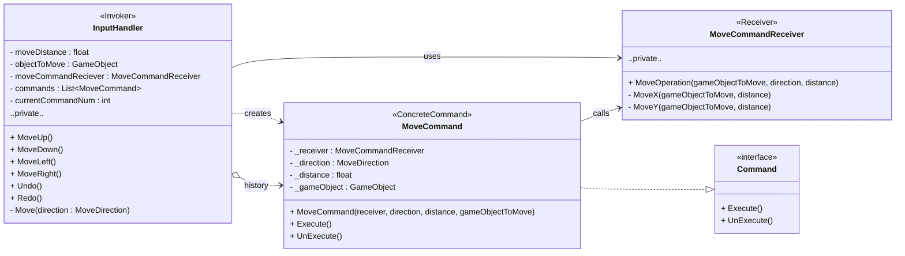
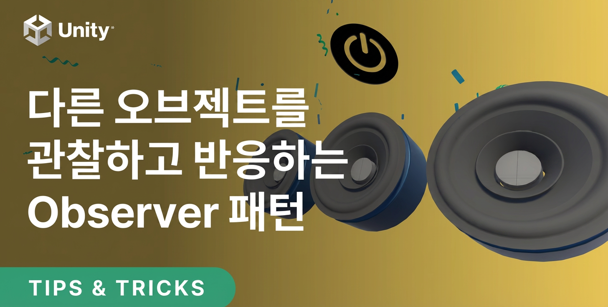
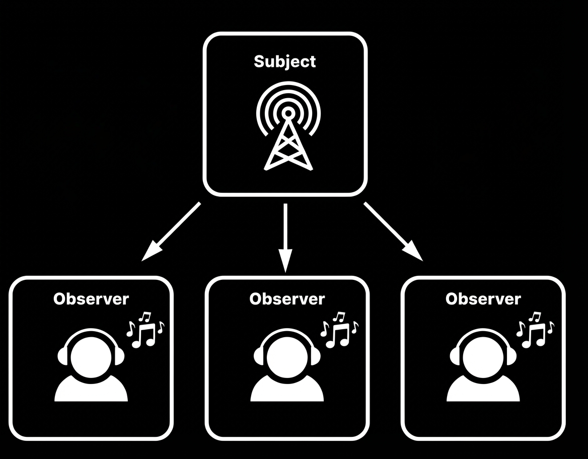
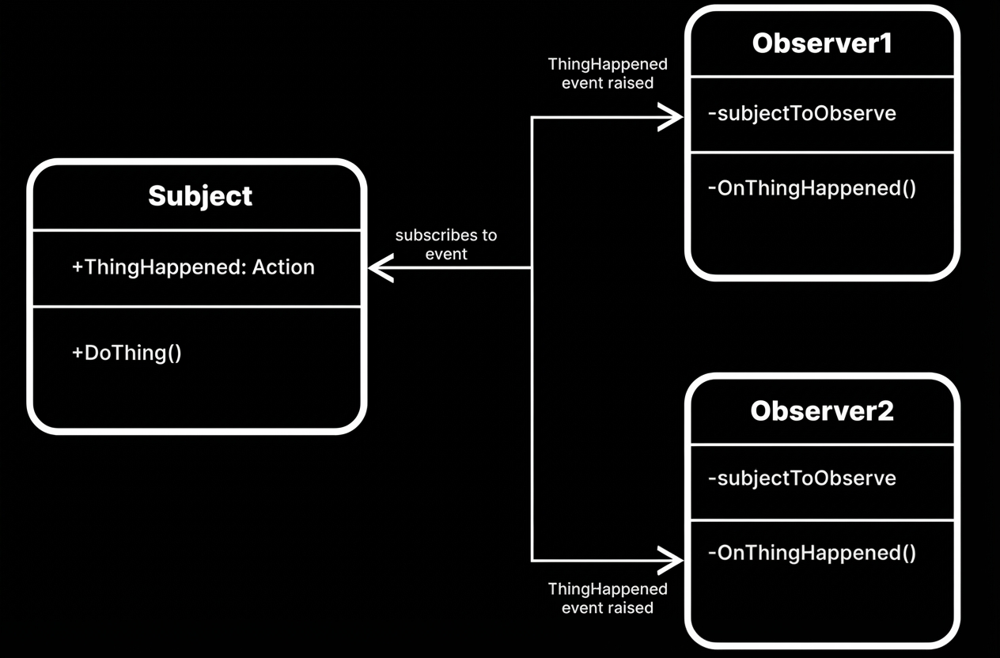

## 개요

디자인 패턴에 대해 보통 부정적인 시각을 가지신 분은 이렇습니다.

1. 적용 시키면 구조가 더 복잡해진다.
2. 적용 시키면 퍼포먼스가 떨어진다.
3. 게임은 기획이 바뀌면 설계를 바꿔야 할 때가 있다.
   = 어차피 나중에 갈아 엎게 되어있다.

## 목차

1. 커맨드(Command) 패턴은 무엇인가?
2. 옵저버(Observer) 패턴은 무엇인가?
3. 게임 실무 사용 예
4. Q&A

## 커맨드 패턴

커맨드 패턴(Command pattern)이란 요청을 객체의 형태로 캡슐화하여 사용자가 보낸 요청을 나중에 이용할 수 있도록 매서드 이름, 매개변수 등 요청에 필요한 정보를 저장 또는 로깅, 취소할 수 있게 하는 패턴이다.

이 패턴을 통해 실행(Do), 취소(Undo), 재실행(Redo), 명령 큐잉(Queuing), 로깅(Logging), 네트워크 전송(Remote Invocation) 등을 가능하게 하여 명령의 실행 시점과 호출 시점을 분리하고 유연한 명령 제어를 구현할 수 있다.

### 장단점

장점
• 확장성: 호출자와 수신자를 분리함으로써 새로운 커맨드나 기능 추가에 용이합니다.
• 시퀀싱: 되돌리기 기능, 매크로, 명령 큐의 구현을 허용하고 입력을 큐에 넣는 작업을 용이하게 한다.

단점
• 복잡성: 각 명령이 그 자체로 클래스이기 때문에 구현에 수많은 클래스가 필요하고, 유지보수를 위해 패턴의 이해도가 요구된다.

### 구성요소

- **Command**(명령): `Execute()`, (선택) `Undo()` 인터페이스
- **Receiver**(수신자): 실제 동작을 수행하는 대상(캐릭터, 월드, 인벤토리 등)
- **Invoker**(호출자): 커맨드를 생성/스케줄/실행/취소하는 주체(입력 시스템, 스킬 매니저 등)
- **Client**: 커맨드 인스턴스를 조립(의존성 주입)

### 언제 쓰나

- 입력을 행위로 추상화(입력장치·플랫폼 독립)
- Undo/Redo, 리플레이, 매크로, 네트워크(입력 동기화) 구현
- 작업 큐(비동기 일괄 실행), AI/스킬 시퀀싱

### UML

---

## 옵저버 패턴

옵저버 패턴은 하나의 객체의 상태 변화가 있을 때, 그 객체와 연관된 다른 객체들(옵저버, Observer) 에게 자동으로 알림(Notify) 이 전달되어, 상태를 동기화하거나 반응하도록 하는 디자인 패턴입니다.

### 장단점

장점

• **느슨한 결합**
→ 주체와 옵저버 간의 결합도를 낮출 수 있음
• **재사용성**
→ 주체와 옵저버를 재사용하기 쉬움
• **확장성**
→ 주체 클래스나 기존의 옵저버를 수정할 필요 없이, 새로운 옵저버를 쉽게 추가할 수 있음
주체는 상태 변화를 관리하고, 옵저버는 그 변화를 처리
• **이벤트 기반 시스템 구현 용이**
→ UI 이벤트(MVP/MVC), 네트워크 이벤트, 데이터 변경 이벤트 처리 등

단점

• **복잡성 증가**
→ 다수의 옵저버가 존재할 때, 시스템의 복잡성이 증가할 수 있음
• **예측 불가능한 순서**
→ 주체가 이벤트를 발생시키면 옵저버들 간의 호출 순서 보장 안됨
• **메모리 누수**
→ 옵저버가 주체의 이벤트를 구독한 후 해지하지 않으면, 메모리 누수가 발생할 수 있음
• **성능 문제**
→ 옵저버의 수가 많거나 각 옵저버가 처리해야 할 로직이 복잡하면 성능이 저하
• **순환 참조**
→ 주체와 옵저버 간에 순환 참조(Circular Reference)가 발생할 수 있음
• **강한 결합**
→ 주체와 옵저버 간의 강한 결합이 발생 가능. 남용하면 시스템의 모듈화가 어려워짐
• **디버깅 어려움**
→ 이벤트가 객체에 의해 처리되기 때문에, 디버깅과 로그 추적이 복잡해짐

### 구성요소

- **Subject(주체, 발행자, Publisher)**: 상태를 가지고 있으며, 옵저버(구독자)를 등록·해제하고 상태 변화 시 알림을 보냄.
- **Observer(옵저버, 구독자, Subscriber)**: Subject의 변화를 감시하며, 변경이 발생하면 콜백 메서드(Update() 등)를 통해 반응.
- **Notification**: 상태 변경 메시지(이벤트 인자)

### 언제 쓰나

- UI 바인딩(HP, 코인, 퀘스트), 인벤토리/로딩 상태 통지
- 게임 상태(State) 전파(Playing/Paused/GameOver)
- 이벤트 버스/시스템 간 결합 제거, 멀티플레이 상태 동기화 트리거
- UniRX, R3, MVVM

### UML

## 추가적으로

Builder 패턴, State(FSM) 패턴

## 참조

- https://github.com/Unity-Technologies/game-programming-patterns-demo
